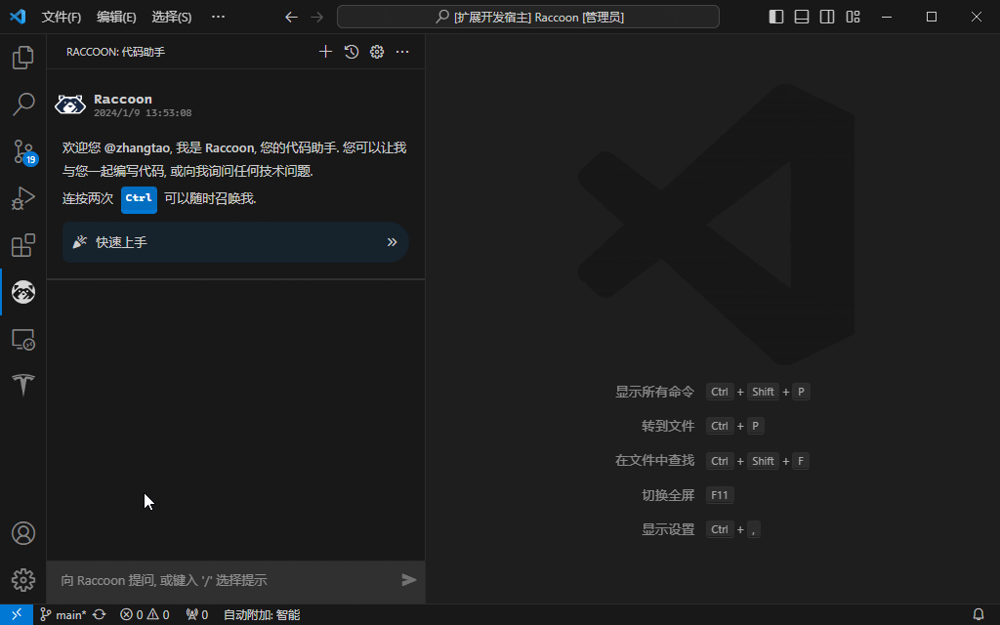

# Raccoon

<p align="center">
  
</p>

<p align="center">
Raccoon (<b>R</b>accoon is <b>A</b>nother <b>C</b>ode <b>CO</b>-pil<b>O</b>t <b>N</b>avigator) is an AI-based code assistant.
</p>

 * [中文文档](README.md)

## Installation and Registration

You can obtain the Raccoon plugin from the following locations:

* [VS Code Extension](https://marketplace.visualstudio.com/items?itemName=SenseTime.raccoon)
* [JetBrains Plugin](https://plugins.jetbrains.com/plugin/23216-raccoon)

Register an account at [code.sensetime.com](https://code.sensetime.com) to begin using Raccoon.

## Account Management

### Login

You can log in to the Raccoon code assistant by clicking the guide link in the welcome message within the Raccoon sidebar view or by clicking the `gear icon` in the panel title bar to access the settings page.

> The display language follows your IDE configuration and automatically switches between Simplified Chinese, Traditional Chinese, English, and Japanese. You can switch it by searching for `Configure Display Language` in the VS Code command palette.


### Logout

Similarly, in the settings page, if you are logged in, you will see the logout button icon in the account information section. Clicking it will log you out.

### Clear All Configurations

Clicking the `Clear All Configurations` button in the settings page will clear all cache-type configurations, restoring them to default. This includes:

* **Privacy Agreement**: The acceptance status will be reset to `Not Selected`.
* **Account Authentication Information**: All authentication information logged in through the web or key input will be cleared.
* **Local History Cache**: Local history information cache will be cleared.
* **Code Snippet Collection**: The collected code snippets will be cleared.
* **Custom Prompt Templates**: If any, they will be cleared. If you want to save them, please manually back up the content.
* **Other Settings**: Reset to default values.

## Code Completion

You can trigger code completion in the editor automatically or manually. Once triggered, the `🦝` icon in the editor status bar at the bottom right will indicate the current request status.


In the settings page, you can configure the code completion in the editor:

* Shortcut:
  * You can click the `keyboard icon` next to the configuration paragraph title to modify it.
* Trigger Delay:
  * Configure the delay from stopping input to triggering the completion suggestion request. It can also be configured as manual, where completion suggestions are only obtained when the hotkey is pressed. The default hotkey is `Alt + /` (mac: `⌥/`).
* Completion Preferences:
  * Line-level completion: Prioritize response speed, returning single-line suggestions.
  * Balanced: Balance response speed and completion suggestion length.
  * Max Length: Allow the model to determine the content to be returned within the maximum allowed range.
* Candidate Suggestion Quantity:
  * Set the number of candidate entries to be returned.

After triggering the completion event, wait for a moment, and the completion content will appear as an inline completion candidate box. You can use the `Tab` key to accept the suggestion. If the candidate quantity is greater than 1, you can use `Alt + [` and `Alt + ]` (mac: `⌥[` and `⌥]`) to browse pages and use the `Tab` key to insert into the editor after confirming the suggestion to accept.

You can also partially accept results, use `Ctrl + →` to accept word suggestions, or use `Ctrl + ↓` to accept line suggestions.

> In the VS Code editor, after triggering the completion event, if there are user's other choices, movements, or input behaviors, the completion operation will be **canceled**.

## Code Assistant

The code assistant solves problems for you through continuous dialogue. Three methods are provided to use the code assistant:

* Sidebar code assistant (GUI): Activate by clicking the Raccoon icon in the VS Code sidebar.
* Editor code assistant (GUI): In the Raccoon sidebar view, click the `More...` option in the title bar and select `New Raccoon Code Assistant` to create. You can create multiple independent instances for multi-threaded development.
* Terminal panel code assistant (CLI): In the Raccoon sidebar view, click `More...` in the title bar, select `New Raccoon Terminal` to create. Similarly, you can create multiple independent instances.


### GUI Code Assistant

In the settings page, you can configure the GUI code assistant:

* Shortcut:
  * You can click the `keyboard icon` next to the configuration paragraph title to modify it.
* Result Display:
  * Configure whether to display the answer result in real-time as a stream or wait for all results to be generated and return at once.

#### Quickly Summon Code Assistant

* Summon the **sidebar code assistant** anytime by double-pressing the `Ctrl` key.
* Right-click in the editor and select `Ask Raccoon...` to go to the **sidebar code assistant**.
* Select part of the code in the editor, click the `lightbulb icon`, or trigger the Code Action menu by pressing the completion hotkey, where Raccoon commands for processing the code will be displayed. You can select and execute them directly. When any code assistant page is **visible**, Code Action asking requests will be answered on that **editor code assistant** page.

#### Ask or Use Preset Prompts

You can enter questions in the question box or start a conversation by typing `/` to choose preset prompts (some operations may require user completion prompts, and after completion, you can click the `send icon` to submit the content).



If there is actively selected code file content in the editor, it will be sent along with the question. At this time, an indicator icon will be displayed next to the send button to indicate that the code has been attached.

The default mode for conversation results is `streaming output`, where the answer will gradually appear during the generation process, allowing you to review the results early. In this mode, you can click the `stop answering` button at any time to terminate the answer.


You can also change the answer mode to `whole output` in the settings page, which will wait for the complete result to be returned and displayed at once.

For recognizable code content in the results, the plugin will display it in a code box and provide buttons for `toggle word wrap`, `add to code collection`, `copy to clipboard`, `copy to clipboard`, and `insert at current file position`, making it easy for you to view and operate.

> Type `?` in the dialog box, enter relevant keywords, and you can launch an Internet search on StackOverflow. Raccoon will show search results so you can browse the information you need without leaving the IDE.

#### About Context

During the questioning process, Raccoon will send a reasonable amount of context information together with the algorithm's token length requirements. If some historical dialogue messages affect the answer, you can manually remove them by clicking the `×` in the upper left corner of the corresponding Q&A entry and trying again.

Or, you can click the `+` button at the top of the Raccoon sidebar title bar to create a new conversation, and existing conversations will be sent as historical information locally cached.

Help information, error messages, and other non-dialogue content will not be sent as context.

You can retrieve the current conversation window's history questions with the `↑/↓` arrow keys, send them directly with the `Enter` key, or use the `Tab

` key to fill in the prompt box for revision before sending.

To provide a more continuous development experience, for the sidebar code assistant page and the unclosed code assistant pages in the workspace, Raccoon will locally cache historical session information. This information will be synchronized and updated with your questions, actions (delete, clear), etc.

#### Managing Historical Information

In the sidebar assistant or editor assistant's title bar, historical management buttons are provided. Click the `History` icon, and you can choose and continue with past history conversations. You can rename or delete conversation history cache.

#### Evaluate Answer Results

After the answer is completed or terminated, the answer's bottom will display an evaluation button. If you have accepted Raccoon's privacy agreement, clicking the corresponding button will collect your evaluation feedback. This is very helpful for us to improve algorithms and product design. Thank you for your support.

Old historical information restored from the last session before opening the IDE does not support evaluation but will still be sent as historical information when a new question is submitted.

### CLI Code Assistant

Simply enter questions after the terminal prompt. The questions and answers in the terminal also support attaching code for questioning and multi-round dialogues based on context. The contexts of multiple terminal instances are independent of each other.

Compared to the sidebar or editor code assistant, the terminal code assistant has limited interaction capabilities. It cannot delete previous dialogues to finely modify the context, and it cannot render output results and code snippets. However, if you need to start a new session in the current terminal, you can press the `Esc` key, and subsequent dialogues will no longer refer to previous content.


## Custom Prompt Templates

You can customize prompt templates to better suit your use case. Click the `Edit icon` above the predefined panel or click `More...` in the title bar to select `Manage Prompt Templates`. This will open the prompt template management page, where you can create or manage your own prompt templates. The plugin will generate corresponding action buttons in the sidebar for you.

Prompt templates can include `{{code}}` to identify prompts that need to capture the code selected by the user for processing by `Raccoon`. Prompt templates containing `{{code}}` will also appear in Code Action for direct invocation after selecting the code.

Prompt templates can include user fill-ins, and you can use `{{input}}` to identify information that needs to be filled in before submitting the question. To better prompt the user, you can write placeholders for the current blanks to display prompt information when the content is empty. For example, `{{input:language}}` will display an editable text box and use `language` as a placeholder for the prompt information.


Here are a few examples:

```handlebars
Write a Dockerfile template
```

```handlebars
Convert {{input:decimal number}} to hexadecimal
```

```handlebars
Extract all function signatures from the following code
{{code}}
```

```handlebars
Translate the following code into {{input:target language}} language
{{code}}
```

## Code Collection

For frequently used code snippets, you can add them to the code collection. Assign a trigger shortcut, and you can quickly insert the snippet during the process of writing code in the corresponding programming language. Code collection is completely local and can be used without logging in.

You can manually create code collection entries, or you can edit and add code generated during the Raccoon Q&A process to the code collection.


When in the Raccoon sidebar assistant view, click `More...` in the title bar and select `Manage Code Collection` to open the code collection management page. Here you can add, modify, or delete code snippets.

> Code snippets may not be provided with the `Add to Code Collection` operation if they do not belong to easily reusable code snippets. However, other convenient operations (such as `Show/Hide Image` for `mermaid`) may be provided.

## Raccoon Notebook 🚧

Raccoon Notebook can help you create interactive, reusable conversation flow files. You can start by creating an example file using `File` > `New File...` > `Raccoon Notebook`, or create your own notebook from scratch by creating a file with any extension as `.rcnb`.

In the Raccoon Notebook file, you can add Markdown cells, `Raccoon`, or `TypeScript` code cells.


## Writing Commit Messages

If there is one or more Git repositories in the current workspace, in the `Source Control` sidebar panel, you will see the `Magic Wand icon` button. Raccoon will understand your staged changes and suggest an appropriate Commit Message in the message box.


## Disclaimer

Before using the Raccoon ("we" or "our") product and related services (hereinafter referred to as "this service"), please read and fully understand this "Disclaimer." If you choose to continue using this service, it means you fully understand and accept the following conditions of use:

* You understand and acknowledge that the output content and code of this service are generated using deep synthesis technology. We make no guarantees regarding the accuracy, completeness, and functionality of the generated content, and the generated content does not represent our stance or viewpoint.
* You understand and agree that the code shown by this service is only a "recommendation." If you choose to adopt the code recommended by this service, it should be considered that you have actually written this code, and you should be the sole copyright owner of the generated or chosen code. We do not assume any responsibility for the security, defects, quality, compatibility, etc., of any code recommended by this service, whether explicit or implied. It is your responsibility to ensure the security and quality of the code you generate (whether entirely self-written or adopted from suggestions made by this service). We recommend that you take the same precautions when using code recommended by this service as when using code you write entirely on your own.
* You agree and undertake not to use this service for the development of applications that violate the law. If you use this service to develop applications for specific industries (such as education, medical, banking, etc.), you must also comply with relevant national regulations on user data protection and content management laws.
* You acknowledge and agree that we will not be held liable for any use of this service or any violation of the above agreements.