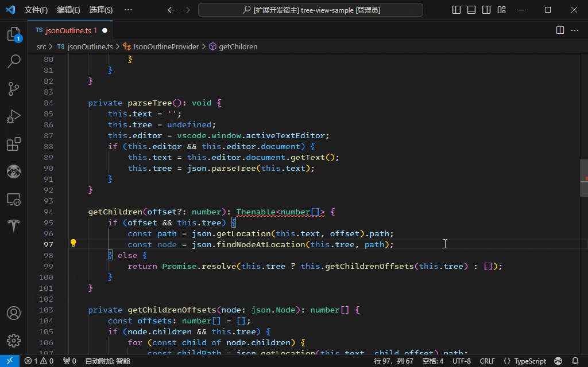
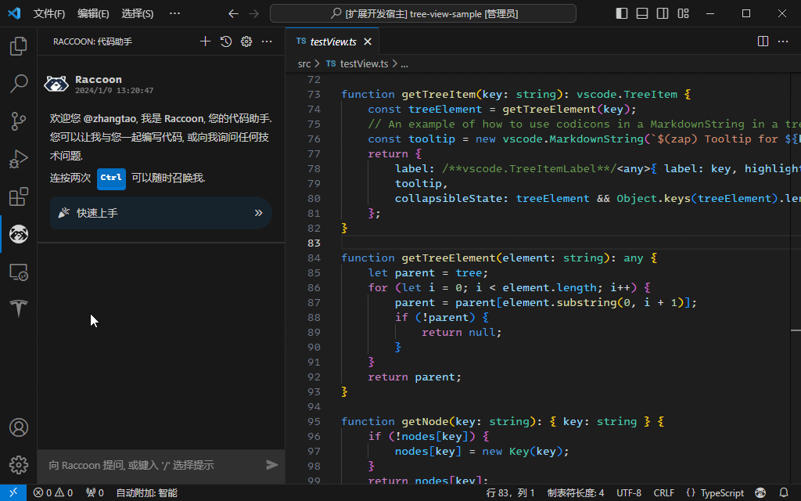
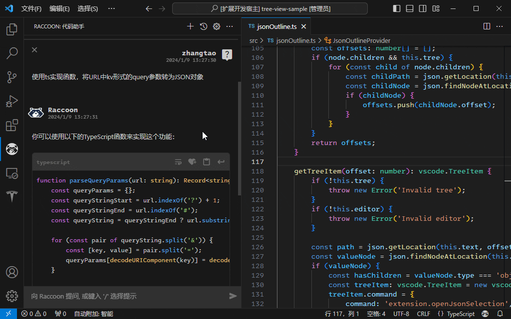

# Raccoon

Raccoon (**R**accoon is **A**nother **C**ode **CO**-pilot and **O**utstanding **N**avigator) 是基于 AI 的代码助手。

## 登录账号

您可以在 Raccoon 代码助手 侧边栏视图中，点击欢迎信息内的引导链接, 或点击面板标题栏上的 `齿轮图标` 进入设置页面进行登录。


> 界面的显示语言会跟随您的 IDE 配置，自动切换 中文/英文，可以在 VS Code 的命令面板中搜索 `Configure Display Language` 来切换。

## 编辑器内代码补全

您可以在编辑器内通过自动或手动方式触发代码补全，一经触发，编辑器状态栏右下的 `🦝` 图标将指示现在的请求状态。



在设置页面中，可以配置编辑器内代码补全的

* 触发方式：
  * 手动：当按下热键时获取补全建议，默认的热键为 `Alt + /`, 您可以点击右侧 `键盘图标` 进入设置来进行修改
  * 自动：当输入停止时获取补全建议，您可以点击 `秒表图标` 来切换延迟时间的长短，此时手动触发仍然有效
* 补全偏好：
  * 速度优先：优先保证响应速度，返回简短的补全建议
  * 平衡：兼顾响应速度和补全建议长度
  * 最大长度：由模型在最大允许范围内自行确定返回内容
* 候选建议数量：
  * 设置返回候选条目的数量

触发补全事件后，稍等片刻补全内容会以行内补全候选框形式出现，您可以使用 `Tab` 键接受建议。候选数量大于 1, 可以使用 `Alt + [` 及 `Alt + ]` 来进行翻页浏览，确定要接受的建议项后，使用 `Tab` 键插入编辑器。

> VS Code 编辑器在触发补全事件后，如遇用户的其他选择、移动、输入行为，则会 **取消** 补全操作。

## 代码助手

代码助手通过连续对话方式为您解决问题，我们提供了三种方式来使用代码助手：

* 侧边栏代码助手：点击 VS Code 侧边栏的 Raccoon 图标激活
* 编辑器内代码助手：在 Raccoon 侧边栏视图中，点击标题栏上的 `新窗口图标` 创建，可以创建多个独立实例，便于多线开发
* 终端面板内代码助手：在 Raccoon 侧边栏视图中，点击标题栏上的 `更多...` 选择 `新建 Raccoon 终端` 创建，同样的可以创建多个独立实例


### 侧边栏及编辑器内的代码助手

#### 快速召唤代码助手

* 随时通过连按两次 `Ctrl` 键，召唤**侧边栏代码助手**
* 在编辑器内单击右键选择 `向 Raccoon 提问...`，**侧边栏代码助手**
* 在编辑器内选择部分代码，通过补全热键（默认为 `Alt + /`）触发 Code Action 菜单，其中将显示可处理代码的 Raccoon 命令，您可以直接选择执行<sup>*</sup>

> 当有任意编辑器内代码助手页**可见**时，Code Action 提问请求将优先在该**编辑器内代码助手**页回答。

#### 提问或使用预设提示

你可以在提问框中输入问题，或通过键入 `/` 选择预设提示（部分操作可能需要用户补全提示，完成补全后可以点击 `发送图标` 提交内容）开始对话。


如在编辑器内有活动的代码文件内容被选中，则会随问题一起发送，此时发送按钮旁会显示已附加代码的指示图标。


对话结果默认为 `流式输出` 模式，即回答将在产生过程中逐步显示，以便于您提早审阅结果，在这种模式下，您可以随时点击 `停止回答` 按钮来终止此次回答。

您也可以在设置页面中将回答模式改为 `整体输出`，此时将等待完整结果返回，并一次性显示。

对于结果中可识别的代码内容，插件将以代码框形式显示，并提供 `切换自动换行`, `加入代码收藏`, `复制到剪贴板`, `复制到剪贴板` 和 `插入到当前文件位置` 的按钮，便于您的查看和操作。

> 在对话框内键入 `?` 并输入相关关键词，可以向 StackOverflow 发起互联网检索，Raccoon 会展示检索结果，使您不离开 IDE 就能浏览需要的信息。

#### 自定义提示词

您可以自定义提示词，以更好地适用于您的使用场景。在配置页面点击自定义提示词 `灯泡图标`，将帮您定位到 Raccoon 的设置中，您可以在此添加自己的提示词，插件将在侧边栏中生成对应的操作按钮。

提示词中可以包含 `{{code}}` 来标识该提示需要抓取用户框选的代码，一并提交 `Raccoon` 处理。

提示词中可以包含用户填空，可以使用 `{{input}}` 来标识需要填写对应位置的信息后再通过主动点击 `发送图标` 提问。为了更好地提示用户，您可以为当前填空编写占位符，在内容为空时显示提示。如 `{{input:language}}` 将会显示可编辑文本框，并以 `language` 作为提示信息占位显示。



以下是一个示例：

```json
"Raccoon.Prompt": {
    "创建 Dockerfile 模板": "编写一个 Dockerfile 模板",
    "十六进制转换": "将{{input:十进制数}}转换为十六进制",
    "提取代码中的函数签名": "提取以下代码{{code}}中的所有函数签名",
    "代码翻译": "将以下代码{{code}}翻译为{{input:目标语言}}语言代码",
}
```

#### 代码收藏与管理

对于经常使用的代码片段，可以加入代码收藏，为其指定一个触发快捷词后，即可在使用对应编程语言编写代码的过程中，通过快捷词快速获取片段并插入。



您可以手动创建代码收藏条目，或者可以将 Raccoon 问答过程中产生的代码编辑后加入代码收藏。

在 Raccoon 侧边栏助手视图时，点击标题栏上的 `更多...` 选择 `管理代码收藏`，或通过设置页面中的管理代码收藏 `书签图标`，可以打开代码收藏管理页面，在这里可以添加、修改、删除代码片段。

> 结果中的代码可能不属于易复用的代码片段，则不会提供 `加入代码收藏` 的操作，但可能提供其他便捷操作（如针对 `mermaid` 会提供 `显示/隐藏图像` 的操作）。

#### 评价回答结果

在回答结束或回答被终止后，答案底部将显示评价按钮，如果您接受了 Raccoon 的隐私协议，当您点击对应按钮时，我们将收集你的评价反馈，这对我们改进算法和产品设计很有帮助，十分感谢您的支持。

对于从打开 IDE 前的上次会话恢复而来的旧的历史信息，不支持评价，但仍会在新问题提交时，作为历史信息上文一同发送。

### 终端面板内的代码助手

直接在终端提示符后输入问题即可，在终端中的问答同样支持附加代码提问，以及基于上下文的多轮对话，多个终端的上下文相互独立。


相比于侧边栏或编辑器内代码助手，终端代码助手交互能力有限，无法删除前序对话来精细地修改上下文，也无法渲染输出结果及代码段，但如果需要在当前终端中新启会话，可以按 `Esc` 键，后续对话将不再参考之前的内容。

### 提问过程中的上下文使用

在提问过程中，Raccoon 会按照算法 token 长度要求，携带合适数量的上下文信息一起发送。当有部分历史对话消息影响回答效果时，您可以通过点击对应问答条目左上角的 `×` 手动将其移除后再试。

或者您可以点击 Raccoon 侧边栏顶部标题栏上的 `清空对话` 按钮来清空当前对话。

帮助信息和错误提示等非对话内容，不会作为上下文发送。

您可以通过 `↑/↓` 方向键调取当前对话窗的历史提问，通过 `Enter` 键直接发送，或使用 `Tab` 键来填入提示框待修订后发送。

为了提供更加连续的开发体验，对于侧边栏代码助手页面，及工作区中未关闭的代码助手页面，Raccoon 会将历史会话信息本地缓存，这些信息会随着您的问答，操作（删除、清空）等同步更新内容。

当您想要主动清理保存会话历史信息的缓存文件时，可以在设置页面中点击 `清理历史缓存` 按钮。

## 使用 Notebook 创建可保存、可复现的对话文件 (Experimental)

您可以在 Raccoon 侧边栏视图中，点击标题栏上的 `更多...` 选择 `新建 Raccoon Notebook` 新建一个 Notebook 文件。

在 Raccoon Notebook 文件中，可以添加 Markdown 单元格、 `Raccoon` 或 `TypeScript` 代码单元格。

详细信息可以通过 `File` > `New File...` > `Raccoon Notebook` 来创建示例文件开始了解。


## 由 Raccoon 来帮您撰写 Commit Message

如当前工作空间存在一个或多个 Git 仓库，在 `源代码管理` 侧边栏面板中，会看到 `魔棒图标` 按钮，Raccoon 会理解您已暂存的更改，并在消息框中撰写合适的 Commit Message 建议。

## 清除所有配置

在设置页面中点击 `清除所有配置` 按钮，将清除所有缓存类型的配置，恢复默认状态，清除内容包括：

* **隐私协议**：接受状态将被重置为 `未选择`
* **账号认证信息**：您的所有通过网页或输入秘钥方式登录的认证信息将被清空
* **本地历史缓存**：本地历史信息缓存将被清除
* **代码片段收藏**：收藏的代码片段将被清除
* **自定义提示词**：如有将被清空，如需保存，请手动备份内容
* **其余设置**：恢复默认值

## 免责声明

在使用 Raccoon（“我方”）产品及相关服务（以下简称 “本服务”）前，请您务必仔细阅读并理解透彻本《免责声明》。 请您知悉，如果您选择继续使用本服务，意味着您充分知悉并接受以下使用条件：

* 您知悉并理解，本服务的输出内容及代码，为使用深度合成技术生成的文本信息，我们对其生成内容的准确性、完整性和功能性不做任何保证，并且其生成的内容不代表我们的态度或观点。
* 您理解并同意，本服务所为您展示的代码只是 “推荐”，若您选择采纳本服务所推荐的代码，应当视为您实际撰写了此代码，您应当是所产生、选择的代码的唯一著作权人。我方不会就本服务所推荐的任何代码承担安全、瑕疵、质量、兼容等任何保证责任，无论是明示或暗示，您有责任确保你生成的代码的安全和质量（无论其是由您完全自主撰写或者是采纳了本服务提出的建议），我们建议您在使用本服务推荐的代码时采取与使用您完全自主编写的代码时相同的预防措施。
* 您同意并承诺，不会使用本服务进行违反法律的应用开发，如您使用本服务开展特定行业的业务应用（如教育、医疗、银行行业），将同时遵守相关国家规定的用户数据保护法律和内容管理法律。
* 您确认并同意，我方不会因为本服务或您使用本服务违反上述约定，而需要承担任何责任。
